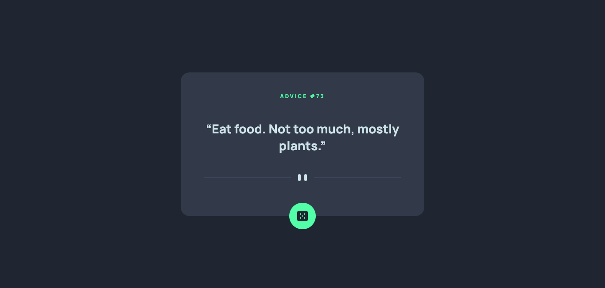
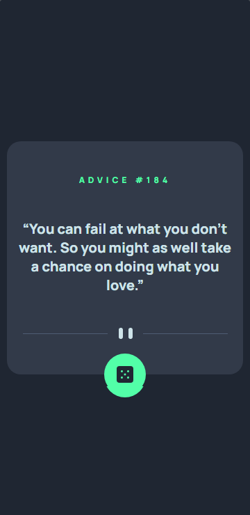

# Frontend Mentor exercise solution - Advice generator app

This is a solution to the [Advice generator app challenge on Frontend Mentor](https://www.frontendmentor.io/challenges/advice-generator-app-QdUG-13db). Frontend Mentor challenges help you improve your coding skills by building realistic projects.

## Built with

 **HTML5**
  - Semantic tags

 **CSS3**
  - Flexbox

 **JavaScript**
  - Consults API with fetch

## Screenshot

Desktop: 

Mobile: 

  
## The challenge

The user can click on a die to trigger a script that consults an API for a piece of advice and shows it on the page that is responsive on any device.

### Challenge requirements

In this challenge, I had to:

- Match the page as closely as possible to the provided design
- Make the page responsive
- Have hover states for all interactive elements on the page
- Generate a new piece of advice everytime the dice icon is clicked

## Acknowledgements

[Ahmed Zougari](https://www.frontendmentor.io/profile/zougari47) and [Héctor Martin Dama](https://www.frontendmentor.io/profile/HectorMartinDama) at Frontend Mentor showed me ways to fix a bug where Firefox would not generate a new piece of advice, no matter how many times you clicked on the die.